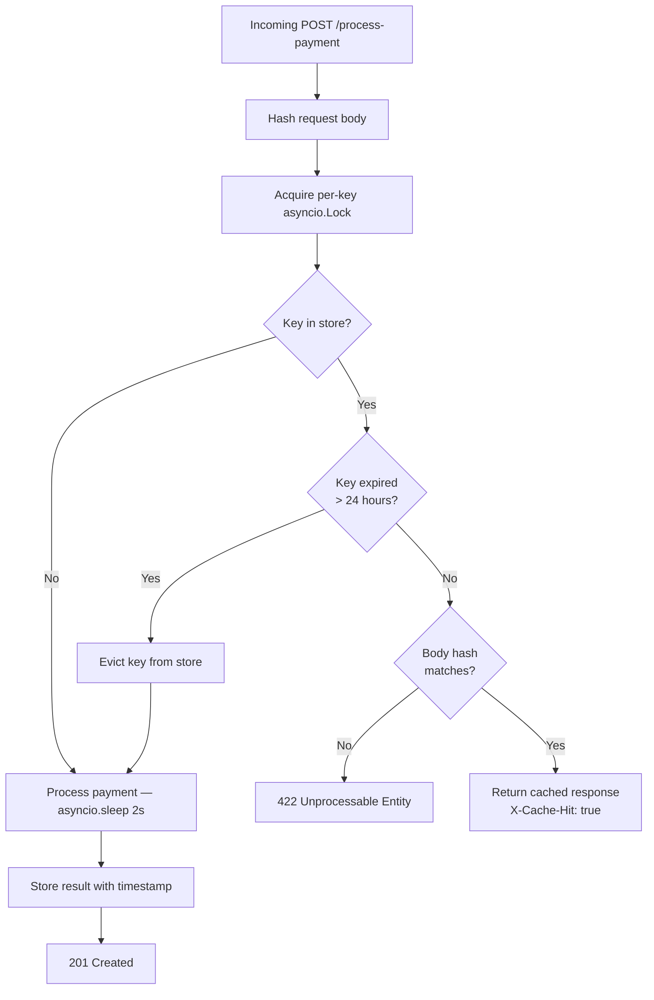

# Idempotency Gateway

A payment processing API that guarantees **exactly-once execution** — no matter how many times a client retries a request due to network failures, the payment is processed only once.

Built with **FastAPI** and Python's native `asyncio`.

---

## Architecture

The sequence diagram below shows how the gateway handles the three core scenarios.


### Internal Request Flow



---

## Tech Stack

| Layer | Technology |
|---|---|
| Framework | FastAPI 0.136 |
| Validation | Pydantic v2 |
| Async runtime | Python asyncio |
| Store | In-memory dict (Redis in production) |
| Server | Uvicorn |

---

## Project Structure

```
Idempotency-Gateway/
├── app/
│   ├── main.py          # FastAPI app, lifespan, router registration
│   ├── config.py        # Constants (TTL, cleanup interval)
│   ├── models.py        # Pydantic models
│   ├── store.py         # In-memory store, hash helper, cleanup task
│   └── routes/
│       └── payments.py  # POST /process-payment endpoint
└── main.py              # Entry point — python main.py starts the server
```

---

## Setup

### Prerequisites
- Python 3.11+

### Install & Run

```bash
# 1. Clone the repo
git clone <your-repo-url>
cd Idempotency-Gateway

# 2. Create and activate a virtual environment
python -m venv venv
source venv/bin/activate       # Mac / Linux
venv\Scripts\activate          # Windows

# 3. Install dependencies
pip install -r requirements.txt

# 4. Start the server
python main.py
```

Server runs at `http://localhost:8000`.  
Interactive API docs (Swagger UI) at `http://localhost:8000/docs`.

---

## API Documentation

### `POST /process-payment`

Processes a payment exactly once per idempotency key.

#### Headers

| Header | Required | Description |
|---|---|---|
| `Idempotency-Key` | Yes | A unique string (UUID recommended) identifying this request |
| `Content-Type` | Yes | `application/json` |

#### Request Body

```json
{
  "amount": 100,
  "currency": "GHS"
}
```

#### Responses

| Status | Scenario | Notes |
|---|---|---|
| `201 Created` | First successful request | 2-second processing delay |
| `201 Created` | Duplicate — same key, same body | Instant replay · `X-Cache-Hit: true` header set |
| `422 Unprocessable Entity` | Same key, different body | Conflict — key already locked to original body |

---

### Example Requests

**First request**

```bash
curl -X POST http://localhost:8000/process-payment \
  -H "Content-Type: application/json" \
  -H "Idempotency-Key: a1b2c3d4-e5f6-7890-abcd-ef1234567890" \
  -d '{"amount": 100, "currency": "GHS"}'
```

```json
{"status": "success", "message": "Charged 100.0 GHS"}
```

**Duplicate request (same key, same body)**

```bash
curl -X POST http://localhost:8000/process-payment \
  -H "Content-Type: application/json" \
  -H "Idempotency-Key: a1b2c3d4-e5f6-7890-abcd-ef1234567890" \
  -d '{"amount": 100, "currency": "GHS"}'
```

Returns the same `201 Created` body instantly. Response includes header `X-Cache-Hit: true`.

**Conflict (same key, different body)**

```bash
curl -X POST http://localhost:8000/process-payment \
  -H "Content-Type: application/json" \
  -H "Idempotency-Key: a1b2c3d4-e5f6-7890-abcd-ef1234567890" \
  -d '{"amount": 500, "currency": "GHS"}'
```

```json
{"detail": "Idempotency key already used for a different request body."}
```

---

## Design Decisions

### 1. Per-key `asyncio.Lock` for race condition safety

A single `asyncio.Lock` per idempotency key ensures that if two identical requests arrive simultaneously (while the first is still in its 2-second processing window), the second one waits rather than starting a duplicate payment. The idempotency check is placed **inside** the lock so the second request, once unblocked, re-checks the store and finds the first request's stored result.

A plain `threading.Lock` would block the entire event loop. `asyncio.Lock` suspends only the waiting coroutine, leaving all other requests free to proceed.

### 2. SHA-256 body fingerprinting

Instead of storing the raw request body, we store a SHA-256 hash of it. This keeps the store lightweight and makes hash comparison O(1) regardless of body size. Keys are sorted before hashing (`json.dumps(..., sort_keys=True)`) so field order never produces a false mismatch.

### 3. In-memory store

A plain Python `dict` is used for simplicity and zero infrastructure overhead. In a production deployment this would be replaced with **Redis** using `SET key value EX 86400 NX` (atomic set-if-not-exists with TTL), which also handles distributed deployments across multiple server instances.

---

## Developer's Choice — Idempotency Key TTL with Background Cleanup

### What was added

Idempotency keys expire after **24 hours** (`KEY_TTL_SECONDS = 86400`). A background coroutine (`cleanup_expired_keys`) sweeps the store every hour and evicts all keys older than the TTL.

### Why it matters

Without expiry, every key ever used accumulates in memory for the lifetime of the process. In a high-traffic payment system processing thousands of transactions per hour, this becomes a memory leak. Worse, if a client ever reused a key after a long gap, the server would replay a stale response rather than processing a new payment.

The 24-hour window matches industry standards (Stripe uses the same TTL) — long enough that any legitimate retry will still hit the cache, short enough to prevent unbounded memory growth.

### How it works

```
Server startup
    └── asyncio.create_task(cleanup_expired_keys())
            └── every hour:
                    scan store for keys where now - created_at > 86400s
                    delete expired keys from store and lock registry
```

The sweep uses `list(idempotency_store.items())` to take a snapshot before iterating, preventing a `RuntimeError` from mutating the dict while looping over it.
